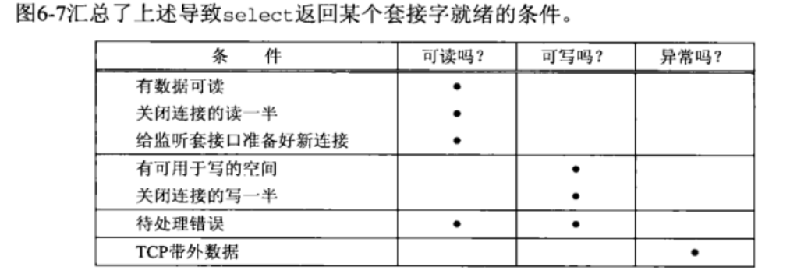

# netty-rpc

# 1.前期知识

### 1.IO模型

阻塞IO、非阻塞IO、多路复用IO、信号驱动IO、异步IO；

前4中模型都是阻塞I/O模型，因为在内核向进程复制数据的过程中都会阻塞

#### 1.一个输入操作通常包含两个不同阶段：

1.等待数据准备好

2.从内核向进程复制数据

#### 2.IO多路复用：

通过系统调用select或poll，阻塞在这两个系统调用中的某一个之上，而不是真正阻塞在I/O系统调用上

阻塞select调用，等待数据报套接字可读，当select返回套接字可读这一条件，我们调用recvfrom把所读数据报复制到应用进程缓存区

#### 3.select 函数

`maxfdpl`指的是待测试的描述符个数

`readset writeset exceptset`分别是要让内核测试读、写和异常条件的描述符集合

`timeout`是设置select的超时时间：分别有永久等待、等待一段时间、不等待三种状态

最后的返回值是表示所有描述符集的总位数，任何描述符就绪之前定时器到的话就返回0，-1表示出错

select函数修改由readset、writeset金额exceptset所指向的描述符集，因而这三个参数都是即是值又是结果，调用函数时，我们指定所关心描述符的值，函数返回，结果将指示哪些描述符就绪。该函数返回后，我们使用函数测试fd_set也就是上面三额set数据类型中的描述符。**描述符集内任何与未就绪描述符对应返回的位时均清0，简而言之，就是没有就绪就清0，所以我们遍历集合就可以找出为1，然后，下次调用我们都得再次把所有描述符集内所关心的位置为1**

select使用的fd_set是固定长度的BitsMap，来表示文件描述符集合，而且支持的文件描述符的个数睡邮箱的，默认值由FD_SETSIZE限制为1024，只能监听0~1023的文件描述符；

**缺点：**

1.固定长度 

2.fd_set 不可重用 

3.用户态内核态拷贝fd_set有开销 

4.每次select结束都要O(n)遍历

#### 4.poll函数

poll 不再用 BitsMap 来存储所关注的文件描述符，取而代之用动态数组，以链表形式来组织，突破了 select 的文件描述符个数限制，当然还会受到系统文件描述符限制。使用的是`pollfd`结构体的动态数组

fd是文件描述符，events，revents作为参数和返回值

select和poll，**都是使用「线性结构」存储进程关注的 Socket 集合，因此都需要遍历文件描述符集合来找到可读或可写的 Socket，时间复杂度为 O(n)，而且也需要在用户态与内核态之间拷贝文件描述符集合**，这种方式随着并发数上来，性能的损耗会呈指数级增长

#### 5.epoll函数

epoll使用：

**1.epoll_create()**

创建eventpoll，返回器文件表示的描述符epfd，创建的eventpoll内部的数据结构：

rbtree：红黑树，每个被加入到epoll监控的文件事件会创建一个epitem结构，作为rbtree节点，可容纳大量文件事件，方便增删改（`O(lgN)`）

rdlist：内核链表，用于存放产生了就绪事件的文件描述符

等待队列wq：调用epoll_wait()进程阻塞放入此队列

**2.epoll_ctl**

操作epoll_create返回的epfd文件描述符新增监控事件

events有：`EPOLL_CTL_ADD`、`EPOLL_CTL_MOD`、`EPOLL_CTL_DEL`新增、修改、删除红黑树上的文件句柄

其中epll_ctl：`EPOLL_CTL_ADD`新增句柄不仅仅新增红黑树节点，更关键的是对文件开始监控

与`select/poll`的本质区别：并不是调用`epoll_wait`的时候才监听文件，而是`EPOLL_CTL_ADD`的时候就开始监听了、

**关于epoll_ctl_add:**

epoll_ctl_add把当前进程添加到等待队列wq上，并且设置了回调函数，回调函数主要作用：事件发生时，文件句柄被自动拷贝到rdlist，**调用epoll_wait等待的进程们被唤醒**

**3.epoll_wait()**

当事件发送，中断后调唤醒进程，就将就绪的事件从内核事件表中复制到第二个参数events指向的数组中，这个数组只有就绪的事件，所以可以以O(1)时间遍历完。

epoll_wait并不**监听文件描述符**，而是等待rdlist不为空 或 收到信号  或超时，自我阻塞等待唤醒

当rdlist不为空时，就绪文件符，拷贝的过程看边缘触发和水平触发

边缘触发(ET)：使用边缘触发模式时，当被监控的 Socket 描述符上有可读事件发生时，**服务器端只会从 epoll_wait 中苏醒一次**，即使进程没有调用 read 函数从内核读取数据，也依然只苏醒一次，因此我们程序要保证一次性将内核缓冲区的数据读取完；

水平触发(LT)：使用水平触发模式时，当被监控的 Socket 上有可读事件发生时，**服务器端不断地从 epoll_wait 中苏醒，直到内核缓冲区数据被 read 函数读完才结束**，目的是告诉我们有数据需要读取；

**边缘触发的效率比水平触发效率要高：因为只唤醒一次，这样就不用多次调用epoll_wait**

select/poll 只有水平触发模式，epoll 默认的触发模式是水平触发，但是可以根据应用场景设置为边缘触发模式。

####  6.epoll相比select 和poll 区别：

1.epoll使用红黑树跟踪文件描述符，增删时间稳定，并且，只通过对内核的红黑树操作，避免了拷贝用户态到内核态的过程

2.epoll使用事件驱动机制，内核维护了一个链表记录就绪事件，当事件发生时候，就会有回到函数将这个就绪事件添加到列表，返回的是具体有时间的文件描述符，而不用再次去轮询整个集合，提高了检测效率，**内核的效率更高，因为采用事件机制，中断回调添加队列**

#### 7.socket的阻塞与非阻塞

### 2.零拷贝

零拷贝是指计算机执行IO时，不需要先将数据从一个内存区域复制到另一个内存区域，就是从网络设备到用户程序空间传递过程中，减少数据拷贝次数，减少系统调用，实现CPU的零参与，彻底消除CPU的负载

#### 1.实现方式：

- DMA数据传输
- 内存区域映射
- 写时复制

#### 2.具体实现

##### 1.用户态直接IO：整个过程由cpu负责

应用程序可以直接访问硬件存储，操作系统的内核只辅助数据传输，传输数据不经过内核缓存区，这种方式不存在内核空间缓冲区和用户空间缓冲区之间的数据拷贝；

缺点：只使用与不需要内核缓冲区的应用程序，这些应用程序通常在进程地址空间有自己的数据缓存机制，**DBMS**就是典型的例子；这种零拷贝机制会直接操作磁盘 I/O，由于 CPU 和磁盘 I/O 之间的执行时间差距，会造成大量资源的浪费，解决方案是配合异步 I/O 使用。

##### 2.内存映射：

**mmap+write**：将内核缓存区映射到用户缓冲区

使用 mmap 的目的是将内核中读缓冲区（read buffer）的地址与用户空间的缓冲区（user buffer）进行映射，从而实现内核缓冲区与应用程序内存的共享，省去了将数据从内核读缓冲区（read buffer）拷贝到用户缓冲区（user buffer）的过程。

##### **3.一些常用的零拷贝函数实现原理**

Sendfile （DMA+cpu copy）：直接让内核缓存区拷贝到socket缓存区

Sendfile+DMA gether copy：将内核读空间直接拷贝到网卡设备中，只有DMA参与copy

Splice：通过在内核空间的读缓存区和网络缓存区建立管道，pipeline，从而避免两者cpu拷贝操作，直接通过DMA就可以完成整个复制操作

| 拷贝方式                   | CPU拷贝 | DMA拷贝 | 系统调用     | 上下文切换 |
| :------------------------- | :------ | :------ | :----------- | :--------- |
| 传统方式（read+write）     | 2       | 2       | read / write | 4          |
| 内存映射（mmap+write）     | 1       | 2       | mmap / write | 4          |
| sendfile                   | 1       | 2       | sendfile     | 2          |
| sendfile + DMA gather copy | 0       | 2       | sendfile     | 2          |
| splice                     | 0       | 2       | splice       | 2          |

### 3.Java NIO

#### 1.Java NIO 空轮询bug

在系统调用上，使用epoll_ctl对事件进行注册监听的时候，EPOLLERR、EPOLLHUP事件会被自动监听，即使我们没设置，而当连接出现了RST，因为poll和epoll对突然中断的连接socket 会对返回eventSet事件集合置为POLLUP或POLLERR，这时Selector会被唤醒，进而导致CPU100%问题。**根本原因是JDK没有处理好这种情况，比如SelectionKey中就没有定义有异常事件类型**，netty通过被唤醒后执行的时间是否超过超时时间，如果超过默认512次后就会重建selector

# 2.代码编写

### 1.DEMO 01

实现简单的BIO NIO服务器 

对BIO 新建一个客户端就开辟一条线程
